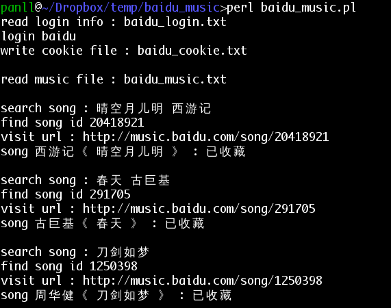

baidu_music_collect
=================
支持指定音乐 
- 批量导入 百度音乐 收藏，省得私人音乐频道猜来猜去
- 批量下载
- 批量生成vlc可用的xspf列表文件，在线播放

用法示例
--------

假设脚本位于 d:\baidu_music
```
d:

cd d:\baidu_music
```

### 查询音乐id，登陆，收藏
- someusr 为用户名，somepasswd 为密码
- cookie.txt 为存放该用户cookie的文件名
- music.txt 为希望收藏的音乐，一行一首，歌名在前（必填），歌手在后（可不填）

```
casperjs baidu_music_id.js music.txt id.txt

casperjs baidu_login.js someusr somepasswd cookie.txt

casperjs baidu_music_collect.js cookie.txt id.txt
```


### 查询音乐id，获取音乐文件url
```
casperjs baidu_music_id.js music.txt id.txt

casperjs baidu_music_url.js id.txt url.txt
```
### 生成wget批量下载的bat文件，生成xspf播放列表文件
```
casperjs baidu_musc_write.js url.txt wget.bat wget

casperjs baidu_musc_write.js url.txt vlc.xspf xspf
```

问题
----

目前 artist 匹配较严，如果查"水晶 任贤齐"，取回结果为"水晶 任贤齐/徐怀珏"，是不做收藏的


### 安装 phantomjs

http://phantomjs.org/

windows下需要把 phantomjs 目录加入PATH环境变量

### 安装 casperjs

http://casperjs.org/

windows下需要把 casperjs/batchbin 目录加入PATH环境变量

### 安装 wget

windows 下可用 http://users.ugent.be/~bpuype/wget/
